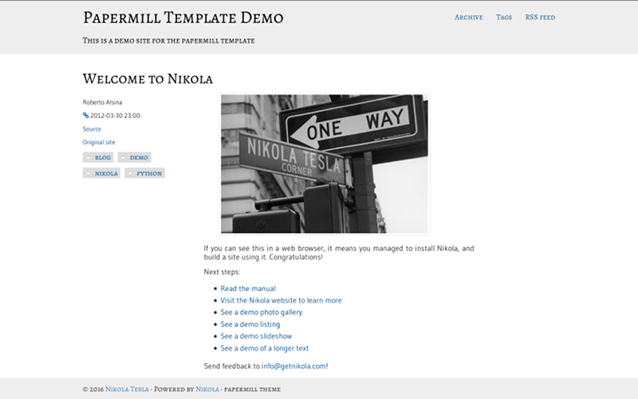

# papermill

**A clean, text-centric theme for the static site generator Nikola based on
Bootstrap 3**

This theme is heavily inspired by the [built-texts]() theme for [Pelican], but
was implemented from the ground up building on the standard Nikola
`base-jinja2` theme and using Bootstrap 3 instead of version 2.

The theme was developed for my personal home page, but feel free to use it for
your own Nikola site. A link to this repository would be appreciated. Maybe
change the color theme a bit too, so your site doesn't look exactly the same as
mine ;) The theme is under the MIT license.

This theme is currently still in beta stage. It doesn't support CDNs or bundles
or any features, which require JavaScript. I'll update the theme, fixing things
and adding new features as I develop and roll out my site.

*© 2016 Christopher Arndt*

[built-texts]: https://github.com/getpelican/pelican-themes/tree/master/built-texts
[Pelican]: https://getpelican.com/
